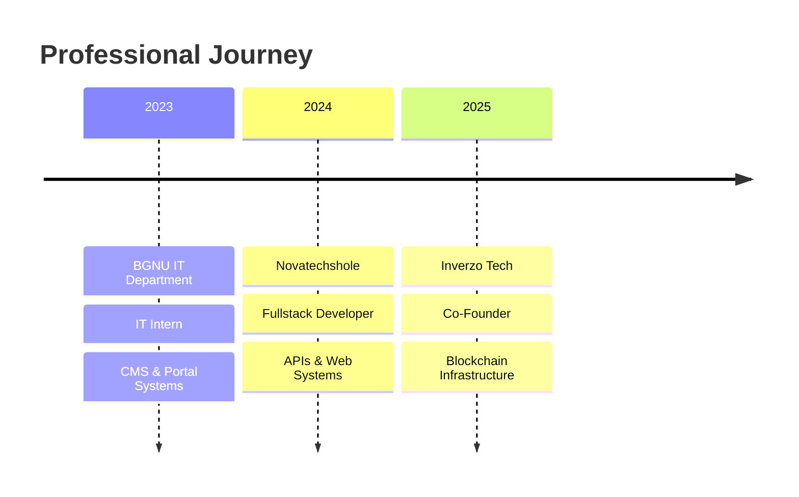

# ⚡ ADVANCED ANIMATED GITHUB PROFILE README

<div align="center">


</div>

<div align="center">


</div>

---

<div align="center">


</div>

---

# 🌙 About Me

<table>
<tr>
<td width="60%">

```yaml
name: Azeem Shahid
located_in: Pakistan
current_role: Fullstack Developer
company: Inverzo Tech
experience: 2+ Years
specialization:
  - Laravel Development
  - React & Vue Ecosystem
  - Flutter Applications
  - REST APIs
  - Blockchain Integrations
  - VPS & Linux Deployment
```

### 🚀 Professional Summary

✨ Passionate Fullstack Developer focused on building scalable and high-performance applications.

🌍 Delivered production-level projects for international clients across multiple countries.

⚡ Specialized in modern backend architectures, frontend systems, and cloud deployment.

🔗 Experienced in blockchain integrations & crypto payment infrastructures.

💡 Obsessed with performance optimization, clean UI/UX, and scalable APIs.

🛠 Skilled in Linux servers, VPS management, CI/CD workflows & production deployments.

</td>

<td width="40%">

<div align="center">

<br><br>

</div>

</td>
</tr>
</table>

---

# ⚡ Interactive Tech Universe

<div align="center">


</div>

---

# 🎨 Frontend Arsenal

<div align="center">


</div>

<p align="center">

</p>

---

# ⚙️ Backend Engineering

<div align="center">


</div>

<table>
<tr>
<td width="50%">

### 🔥 Backend Expertise

* REST API Development
* Authentication Systems
* Database Optimization
* Payment Gateway Integration
* Queue Management
* Secure Backend Architecture
* Scalable Server Infrastructure

</td>

<td width="50%">


</td>
</tr>
</table>

---

# 📱 Mobile Development

<div align="center">


</div>

<p align="center">


</p>

---

# 🚀 Professional Experience

<div align="center">



</div>

---

# 🏢 Current Role — Inverzo Tech

<table>
<tr>
<td width="60%">

## 🚀 Co-Founder & Fullstack Developer

### ⚡ Responsibilities

✔ Leading full-stack development projects

✔ Architecting scalable backend infrastructures

✔ Managing international client projects

✔ Building blockchain-based payment systems

✔ Designing modern frontend experiences

✔ Deploying & maintaining production servers

</td>

<td width="40%">


</td>
</tr>
</table>

---

# 🌍 Featured Projects

<div align="center">

<table>
<tr>
<td width="50%">

# 🔗 Inverzo Gateway

### Blockchain Payment Infrastructure

✨ BEP-20 Integration

✨ TRC-20 Support

✨ Crypto Transactions

✨ Web Payment APIs

✨ Secure Wallet Connectivity

⚡ Status: In Development

</td>

<td width="50%">

# 📱 FindUpNow

### Multi-Platform Application

🚀 Android App

🚀 iOS Application

🚀 Web Dashboard

🚀 Backend APIs

🚀 International Deployment

🌍 Built for Global Clients

</td>
</tr>
</table>

</div>

---

# 📊 GitHub Analytics

<div align="center">


</div>

<br>

<div align="center">


</div>

---

# 📈 Contribution Activity

<div align="center">


</div>

---

# 🏆 Achievements

<div align="center">

| Achievement               | Status |
| ------------------------- | ------ |
| Fiverr Level 1 Seller     | ✅      |
| International Clients     | 🌍     |
| Blockchain Developer      | 🔗     |
| Fullstack Engineer        | ⚡      |
| Co-Founder @ Inverzo Tech | 🚀     |

</div>

---

# 🎓 Education

<div align="center">


### 🏫 Baba Guru Nanak University

</div>

---

# 📜 Certifications

<div align="center">


</div>

---

# 🌐 Connect With Me

<div align="center">

<a href="https://linkedin.com/in/azeemshahid">

</a>

<a href="mailto:raiazeem.dev@gmail.com">

</a>

<a href="https://github.com/Azeem-Shahid">

</a>

</div>

---

<div align="center">


# ⚡ “Building Scalable Digital Solutions For The Modern World.” ⚡


</div>
